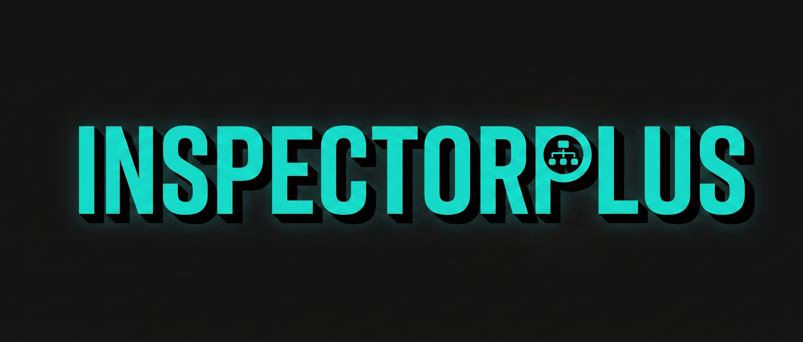

# InspectorPlus

Real-time Android/iOS device UI inspection tool with hierarchical view exploration, tap-to-inspect, and desktop GUI.

**Version:** 0.0.1



---

## Features

- Screenshot streaming via combined `/hierarchy-and-screenshot` endpoint
- Hierarchical UI element tree with expand/collapse
- Hover-to-highlight on canvas (shows element bounds)
- Click-to-tap on device screen
- Multi-device selection via dropdown
- Element property inspection (class, package, resource-id, text, bounds)
- Dark/light Neo-Brutalism theme
- Desktop app via Tauri (or browser-based dev mode)
- F2 Test Recorder — record and export as Python/Java/JS
- F3 WebView Contexts — switch between native and webview
- F4 Hierarchy Search — regex, xpath/resource-id/text filter
- F6 WCAG Accessibility Audit
- D2 Canvas Modes — inspect/coordinate/layout, zoom 0.25x-4x
- iOS Device Support via idb
- ADB Command Panel — execute allowlisted shell commands
- Locator Generation — Appium strategies
- APK Info Panel — version, SDK, permissions

---

## Quick Start

### Prerequisites

- Python 3.13+ (not 3.14 — WebSocket compatibility issue)
- Node.js 18+
- ADB in PATH

### Browser Dev Mode

**Terminal 1 - Backend:**
```bash
cd backend
uv sync --python python3.13
uvicorn main:app --reload --port 8001
```

**Terminal 2 - Frontend:**
```bash
cd frontend
npm install
npm run dev
```

Open `http://localhost:5173`

### Tauri Desktop App

```bash
cd frontend
npm install
npm run tauri dev
```

---

## Tech Stack

| Layer | Technology |
|-------|------------|
| Desktop Shell | Tauri 2 (Rust) |
| Frontend | React 18.3 + TypeScript + Vite 6.0 |
| State | Zustand 5.0 + TanStack Query 5.100 |
| Backend | FastAPI 0.115 (Python 3.13) |
| Android | ADB + uiautomator |
| iOS | idb-companion |

---

## Documentation

| Document | Description |
|----------|-------------|
| [SPEC.md](SPEC.md) | Technical reference: API, architecture, MCP server |
| [docs/DEVELOPMENT.md](docs/DEVELOPMENT.md) | Dev setup, testing |
| [docs/ARCHITECTURE.md](docs/ARCHITECTURE.md) | System design details |

---

## License

MIT