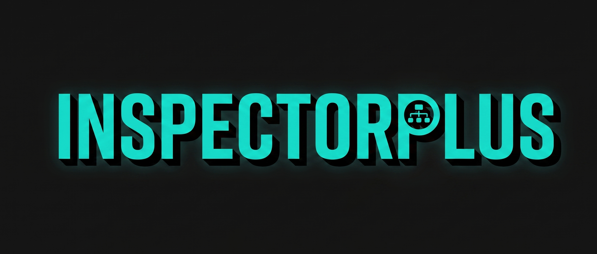

# InspectorPlus

Real-time Android/iOS device UI inspection tool with live screenshot streaming, hierarchical view exploration, tap-to-inspect, and desktop GUI.

[](LICENSE)
[](https://www.python.org/downloads/)

**Version:** 0.0.1



---

## Features

### Core Inspection

- **Screenshot streaming** — combined `/hierarchy-and-screenshot` endpoint with base64 PNG
- **Hierarchical UI tree** — expand/collapse, node IDs, bounds, text, resource-id
- **Hover-to-highlight** — element bounds overlay on canvas
- **Click-to-tap** — tap device screen by clicking canvas
- **Multi-device selection** — dropdown for Android/iOS devices
- **D2 Canvas Modes** — inspect / coordinate / layout, zoom 0.25x–4x with Ctrl+scroll

### Advanced Panels

| Tab | Shortcut | Feature |
|-----|---------|---------|
| Hierarchy | F4 | Search — regex, xpath, resource-id/text filter |
| Accessibility | F6 | WCAG Audit — accessibility issue detection with severity |
| Recorder | F2 | Test Recorder — record steps, export as Python/Java/JS |
| **Network** | **D7** | **Network Debug — mitmproxy App Proxy + VPN Full Intercept** |

### Device & Interaction

- iOS device support via idb-companion
- ADB Command Panel — execute allowlisted shell commands
- Locator Generation — Appium strategies (id, xpath, text, etc.)
- APK Info Panel — version, SDK, permissions, install type
- F3 WebView Contexts — switch between native and webview contexts
- Multi-pointer gesture execution (drag, pinch, swipe, custom)

### Desktop & Runtime

- Tauri 2 desktop app (Rust shell)
- Runtime port switching — configure BE/MCP ports via Settings panel
- Dark/light Neo-Brutalism theme with runtime switching
- Onboarding modal for first-run setup

### Network Debug

Two interception modes:

| Mode | Technique | Catches |
|------|-----------|---------|
| **App Proxy** | `settings put global http_proxy` + `adb reverse` | Only apps honoring system proxy |
| **Full Intercept** | VPN Service on device (10.0.0.2/32, route 0.0.0.0/0) | ALL device traffic including apps with certificate pinning |

- Live traffic stream via WebSocket
- Filter by URL, method, status code
- Request/response headers and body viewer
- MITM certificate push-to-device
- Android VPN app with AUTO_START support

---

## Installation

```bash
# Clone the repository
git clone https://github.com/pempekriting/inspector_plus.git
cd inspector_plus

# Backend
cd backend
uv sync --python python3.13

# Frontend
cd frontend
npm install
```

### Prerequisites

- Python 3.13+ (not 3.14 — WebSocket incompatibility)
- Node.js 18+
- ADB in PATH
- For Network Debug: `pip install mitmproxy`
- For iOS: idb-companion (`brew install facebook/fb/idb-companion`)

---

## Quick Start

### Browser Dev Mode

**Terminal 1 — Backend:**
```bash
cd backend
uv run uvicorn main:app --reload --port 8001
```

**Terminal 2 — Frontend:**
```bash
cd frontend
npm run dev
```

Open `http://localhost:5173`

### Tauri Desktop App

```bash
cd frontend
npm run tauri dev
```

---

## Configuration

### Environment Variables

| Variable | Default | Description |
|---------|---------|-------------|
| `VITE_API_URL` | `http://localhost:8001` | Backend API URL |
| `TMP_BASE_DIR` | System temp | Directory for mitmproxy flow files |

### Ports

- **Backend**: 8001 (configurable)
- **MCP Server**: 8002 (configurable)

---

## Tech Stack

| Layer | Technology |
|-------|------------|
| Desktop Shell | Tauri 2 (Rust) |
| Frontend | React 18.3 + TypeScript + Vite 6.0 |
| State | Zustand 5.0 + TanStack Query 5.100 |
| Backend | FastAPI 0.115 (Python 3.13) |
| Android | ADB + uiautomator |
| iOS | idb-companion |
| Network Proxy | mitmproxy |
| Network Interception | Android VpnService API |

---

## Documentation

| Document | Description |
|----------|-------------|
| [SPEC.md](SPEC.md) | Technical reference: API, architecture, MCP server |
| [docs/DEVELOPMENT.md](docs/DEVELOPMENT.md) | Dev setup, testing, troubleshooting |
| [docs/ARCHITECTURE.md](docs/ARCHITECTURE.md) | System design, REST API, component hierarchy |
| [docs/NETWORK.md](docs/NETWORK.md) | Network debug architecture, VPN app, APK build |
| [docs/MCP_QUICKREF.md](docs/MCP_QUICKREF.md) | MCP server tools reference |

---

## Contributing

Please read [CONTRIBUTING.md](CONTRIBUTING.md) before submitting a pull request.

---

## License

MIT License — see [LICENSE](LICENSE) for details.
